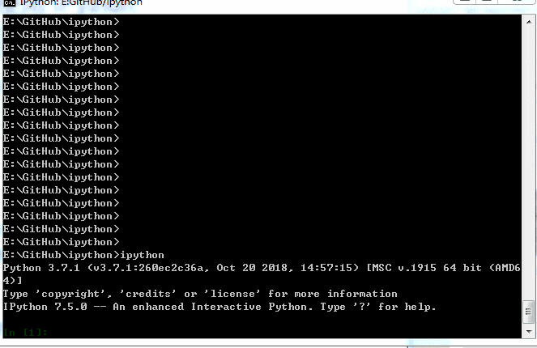
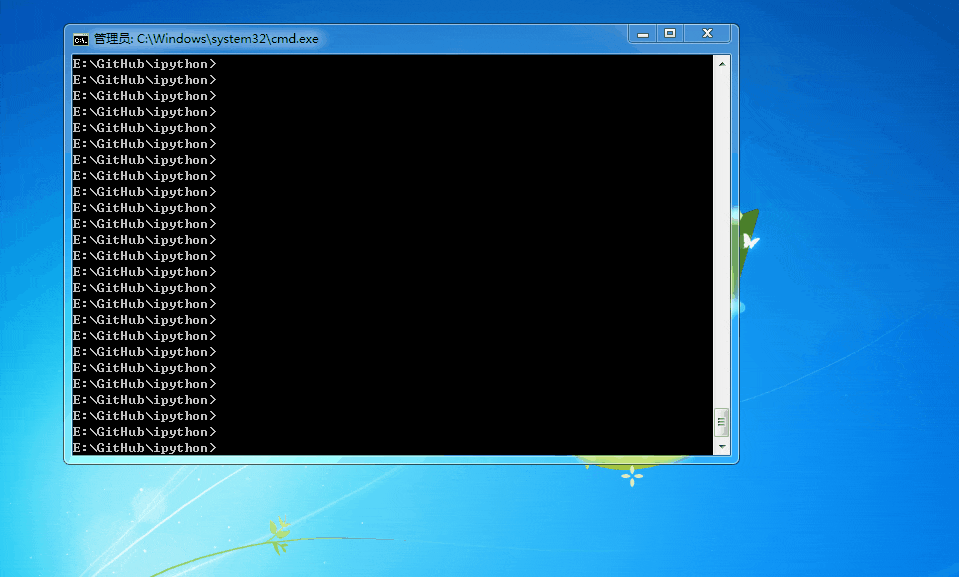

套用阿基米德的话来说，给我一个强大而又灵活的文本编辑器（vim），一个交互式 shell（IPython）以及一个语言（Python），我就能撬动整个世界。

今天来说下为什么一定要使用 IPython，使用它对我们 Python 程序员有什么好处。

#### 1、为什么不想用 Python 自带的交互式环境？

Python 工程师要想快速获得代码的即时反馈，最快捷的做法就是在 Python 交互式环境编写代码试运行，每回车一次都可以知道代码是否有错，或者有输出结果是否符合预期。这种即时反馈都让你对自己的代码更加自信，可以说，Python 交互式环境对初学者非常有帮助。

但是，这个自带的交互式环境有很多弊端：
1、不能在退出时保存历史记录以便未来查询。
2、不支持自动补全。
3、不能查看模块、函数、类的原始代码。
4、不能执行操作系统提供的命令，如 Shell 指令，cmd 指令。

IPython 的出现，不仅解决了以上问题，还提供了强大的魔法命令。请继续往下看。

#### 2、IPython 可以与系统 shell（windows 系统是 cmd） 完美交互。

我们在编写 Python 脚本时经常需要一边编辑 Python 代码，一边去打开 terminal 窗口执行一些 shell 指令，比如使用 pip 安装依赖包，mkdir 创建目录，view 查看日志，这就需要经常切换很多窗口，不仅浪费时间，还分散了注意力。有了 IPython，你可以在写代码的窗口，执行 shell 指令，只需要在 shell 命令的最前面加个感叹号即可： "! shell 指令"。重要的是，shell 命令还可以接收 IPython 环境下定义的 Python 变量，只需要在 Python  变量前加 $ 符号，非常符合 shell 的原生操作习惯。

下面动图展示如何在 Python 的循环语句中调用系统的 mkdir 指令，并传入  Python 参数。


#### 3、便捷的帮助命令。

我想你一定用过 Python 的 help 函数，在没有网络，没有 IDE 的情况下如何获取一个模块的使用方法呢？ 唯有借助于 Python 的 help 函数。系统的 help 函数使用起来有以下缺点：

- 本想看下这个模块都有哪些子模块或者函数，它显示的却太多不需要的信息。
- 本想看下这个模块的原代码，它却无法显示不了，只能自己寻找路径，手动打开原文件。

而 IPython 则使用 ？ 显示简洁的帮助信息，使用 ?? 较为详细的帮助信息，比如模块的原代码。这样的规则同样适用于获取 IPython 的魔法指令的帮助。

请看下面的演示。


我建议使用任何一个工具，都要先学会使用它的帮助命令，这里是最专业，最权威，最快速了解其内部逻辑的东西，而不是什么都去网上搜索。


#### 4、便捷的查看历史命令：%history。

在 IPython shell 中，使用历史命令可以简单地使用上下翻页键即可，另外我们也可以使用 hist 命令(或者 history 命令)查看所有的历史输入，hist 命令等同于 %hist，%history，history，因此不要有记忆的负担。




历史命令可以用来干吗？ 

这个用处非常多，我们一般用 IPython 来快速试错，验证后的代码可以复制出来写在文件里，或者粘贴至别的窗口，程序员要尽量让自己写过的代码可以复用，而不是一次性任务。历史命令可以帮助查看过往的输入，这对于调查问题也非常有帮助。


#### 5、便捷的编辑文件和运行文件功能。

有时候想直接我们编辑文件，或直接运行文件，或者载入文件后添加几行代码再运行，这些 IPython 都已为你设计好，分别对应魔法命令 %edit,%run,%load, 具体操作请看下面的演示。



%run 参数主要有以下这些：

-n 阻止运行源文件代码时__name__变量被设为”__main__”。这会防止以下代码块中的代码被执行。
```python
if __name__ == "__main__":
```

-i 表示源文件就在当前 IPython 的名字空间下运行而不是在一个新的名字空间中。如果你需要源代码可以使用在交互式 session 中定义的变量就会很有用。

-p 使用 Python 的 profiler 模块运行并分析源代码。使用该选项代码不会运行在当前名字空间。


#### 6、便捷的运行时间统计功能。

有些时候，我们需要测试代码的运行时间，或者代码的性能，比如统计某个函数的运行时间，通常我会们在函数开始记录下时间，结束时再记录时间，两者做差就是函数的运行时间，在 IPython 里，这些都异常简单。

- 测试一行代码一次执行的时间 %time
- 测试多行代码一次执行的时间 %%time
- 测试一行代码多次执行的平均时间 %timeit
- 测试多行代码多次执行的平均时间 %%timeit


#### 7、增强的调试功能。

调试代码最佳时期就是错误刚刚发生的时候，在 IPython 中运行代码报错时可以自动进行调试模式，直接跳转到引发异常的那个栈帧。

自动进入调试模式的开关：%pdb

我们以下面的代码（保存为 test_pdb.py）为例来展示如何使用 IPython 的调试功能。

```python
#encoding:gbk

def fun(a,b):
    '''
    计算两个数的商
    '''
    print("a = ",a)
    print("b = ",b)
    val = a/b
    print("a/b = ",val)


print("begin test")
fun(3,0)
print("end test")
```

 IPython 环境操作简要说明 ：
- 输入 %run -d 文件名 来直接进入调试。
- 输入 %pdb 开启关闭报错时自动打开调试模式
- pdb 窗口中：
    - 输入 h 查看帮助
    - 输入 b 行号在某行设置断点
    - 输入 n (next) 表示运行下一行
    - 输入 s(step) 进入函数或模块内部执行
    - 输入 u/d (up/down) 表示在函数调用栈中向上或向下移动
    - 输入 a(args) 显示函数的调用参数
    - 输入 l(list) 显示当前行及上下文的参考代码
    - 输入 w(where) 显示当前位置的完整跟踪。

具有操作请参考以下演示。


 

#### 尾声

IPython 并不是不是完全创新的。Tab 键自动补全，历史记录查询，调试功能，时间统计，配置功能等存在有些年头了，Python 拥有各种级别的自省功能也有段时间了，但 IPython 把来自成熟的 Unix shell，标准 Python shell 以及 Python 语言中的一些最强大的功能整合到了一起，产生出了一个强大的令人难以置信的性能增强工具，我想我会很乐意在接下来的几年中一直使用它。

关注微信公众号 Python七号，一起愉快地学习 Python。

（完）
